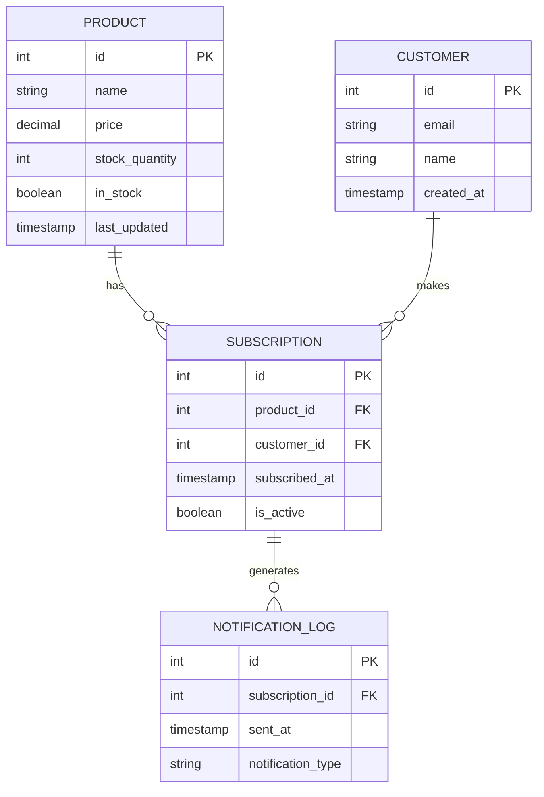
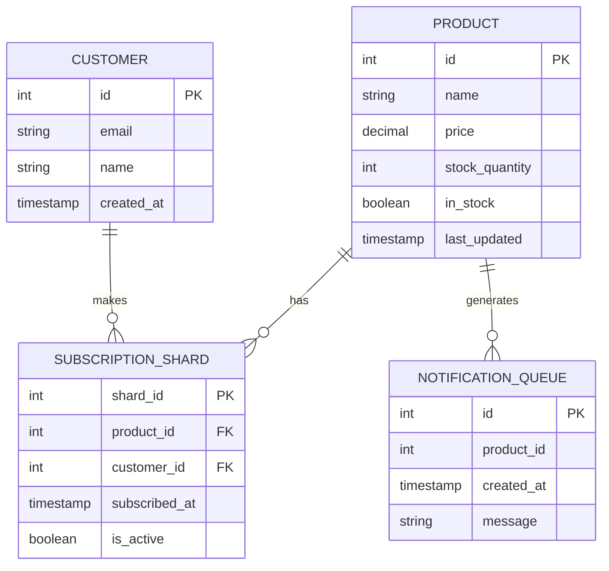
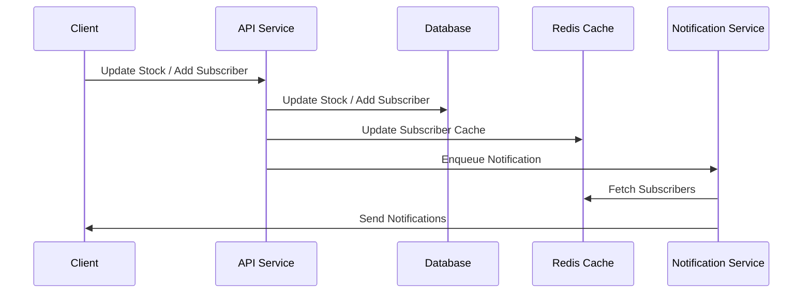

```mermaid
erDiagram
    PRODUCT {
        int id PK
        string name
        decimal price
        int stock_quantity
        boolean in_stock
        timestamp last_updated
    }
    CUSTOMER {
        int id PK
        string email
        string name
        timestamp created_at
    }
    SUBSCRIPTION {
        int id PK
        int product_id FK
        int customer_id FK
        timestamp subscribed_at
        boolean is_active
    }
    NOTIFICATION_LOG {
        int id PK
        int subscription_id FK
        timestamp sent_at
        string notification_type
    }
    PRODUCT ||--o{ SUBSCRIPTION : "has"
    CUSTOMER ||--o{ SUBSCRIPTION : "makes"
    SUBSCRIPTION ||--o{ NOTIFICATION_LOG : "generates"
```

```mermaid
erDiagram
    PRODUCT {
        int id PK
        string name
        decimal price
        int stock_quantity
        boolean in_stock
        timestamp last_updated
    }
    CUSTOMER {
        int id PK
        string email
        string name
        timestamp created_at
    }
    SUBSCRIPTION_SHARD {
        int shard_id PK
        int product_id FK
        int customer_id FK
        timestamp subscribed_at
        boolean is_active
    }
    NOTIFICATION_QUEUE {
        int id PK
        int product_id
        timestamp created_at
        string message
    }
    PRODUCT ||--o{ SUBSCRIPTION_SHARD : "has"
    CUSTOMER ||--o{ SUBSCRIPTION_SHARD : "makes"
    PRODUCT ||--o{ NOTIFICATION_QUEUE : "generates"
```

```mermaid
sequenceDiagram
    participant C as Client
    participant AS as API Service
    participant DB as Database
    participant R as Redis Cache
    participant NS as Notification Service

    C->>AS: Update Stock / Add Subscriber
    AS->>DB: Update Stock / Add Subscriber
    AS->>R: Update Subscriber Cache
    AS->>NS: Enqueue Notification
    NS->>R: Fetch Subscribers
    NS->>C: Send Notifications
```